## Here is my OpenCV Learning Code And Use Experience

### 链接：https://pan.baidu.com/s/11S-QOnE8d8rTN-6Gn44C8Q 密码：7ecv

###  Well, I am not so professional in this, but I'd like to share my learning experinence.

maybe someday it goes to work out my questions~

## Update 1 Learning Links

2018/08/25 Now we come a new stage and I should learn more professional knowledge.

What I have learnt from

This tells you how to normally setup 

https://blog.csdn.net/jia20003/article/details/54583431

and when you got some trouble：Pls check your network(My home network trapped me for a long while)

Problems such as

` Download face_landmark_model.dat Failed (or time out) `
` missing ffmpeg `

but the download is real slow.
you could use your mobile and provide hotspot for your PC.(As I done)

if auto-download can't do to help, you could check these issues :

` https://github.com/opencv/opencv_contrib/issues `

At last ,google can be your best driver.

## Update 2 Get Files Name

 Finally, got it! After check and check again, it works! 

Below is the code of printing all files' name in current catalog
Just paste it in the PowerShell
Attention : the ` F:\OCV\opencv\newbuild\install\x64\vc15\lib ` is my file directory path

 ``` PowerShell
 
Get-ChildItem F:\OCV\opencv\newbuild\install\x64\vc15\lib | ForEach-Object -Process{
if($_ -is [System.IO.FileInfo])
{
Write-Host($_.name);
}
}

 ```


 ##  Update 3 Notice
 
 In the OCV3 Project I don't use src as default input image but use img_1.Which leads me misleading and make some mistakes. In the last days, I should take care of this!!
 

 ## Update 4 Good feature to track

 These two days, i just watch corner detection, one of detection methods is Harris , and another is Shi-Tomasi Corner detetion. In my point of view , Good Features To Track (aka Shi-Tomasi) performs better than Harris detection .

But both of them did not mark the top of roof which human could easily recognize.

Pic blow is ` good feature to track ` 

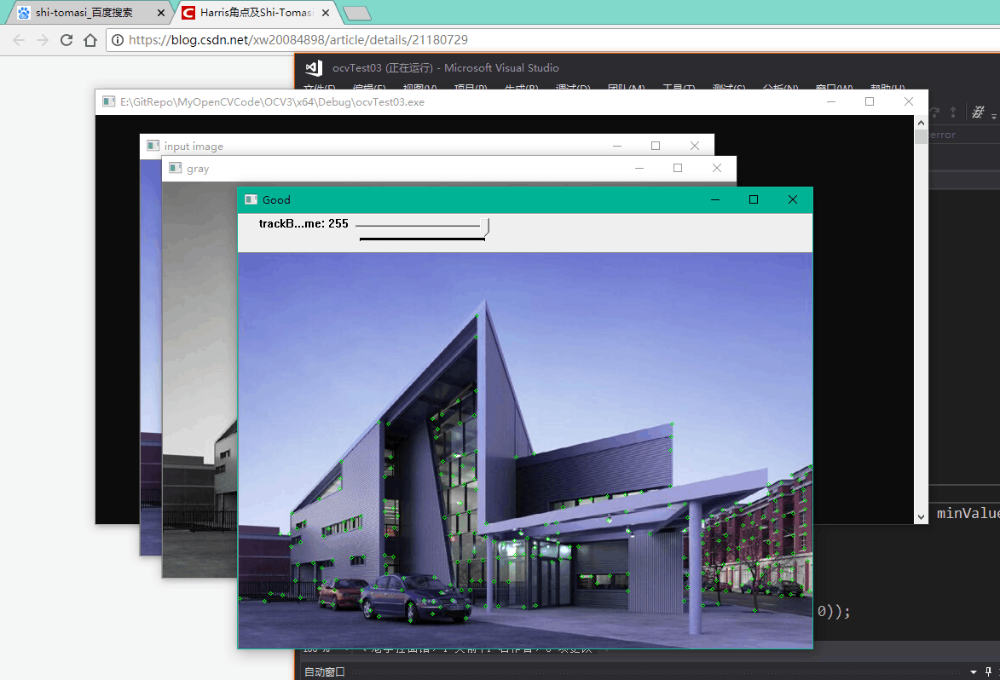


and till now, I should have finished custom corner detection, but I think it is unnecessary to learn. When I meet such kind of projects or problems, I would come back have a careful seek.


## Update 5

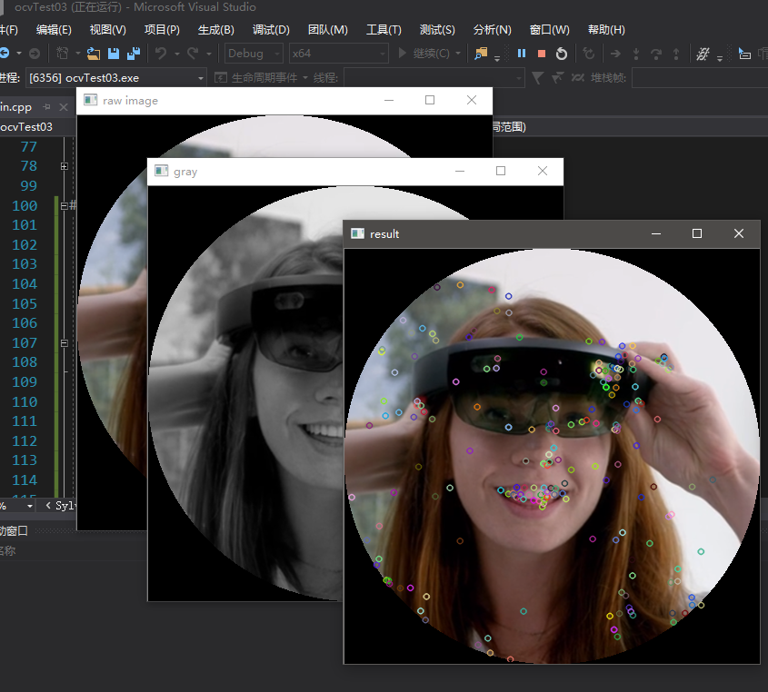

These two days I have tried SURF and SIFT,both of them are using to detect KeyPoints in the image which is hard for human beings to recognize what it is.

And the result of Experiments is that there are not so much differences between SURF and SIFT, but you still say, the KeyPoints of image shows their own features, which we can conclude that SIFT seems better?

Almost forget to say, their sample code looks same.

```C

//SIFT跟SURF代码是一模一样的
//numOfFeatures指的是特征点的个数
int numOfFeatures = 400;
//现在创建检测器
Ptr<SIFT> detector = SIFT::create(numOfFeatures);
vector<KeyPoint> keypoints;//存到这来
//检测 
detector->detect(src, keypoints);
Mat kpImage;
//绘制关键点
drawKeypoints(src, keypoints, kpImage);

namedWindow("result", WINDOW_AUTOSIZE);
imshow("result", kpImage);

```


## Update 6 Histogram of Oriented Gradient

HOG Descriptor 

Here is how to  calculate size of HOG pls refer this Link
https://blog.csdn.net/yangpan011/article/details/78353873

And in the section was tought how to use HOG to establish "Descriptor" detector and use SVM method to detect how many people in the picture you provide.

Just like this.

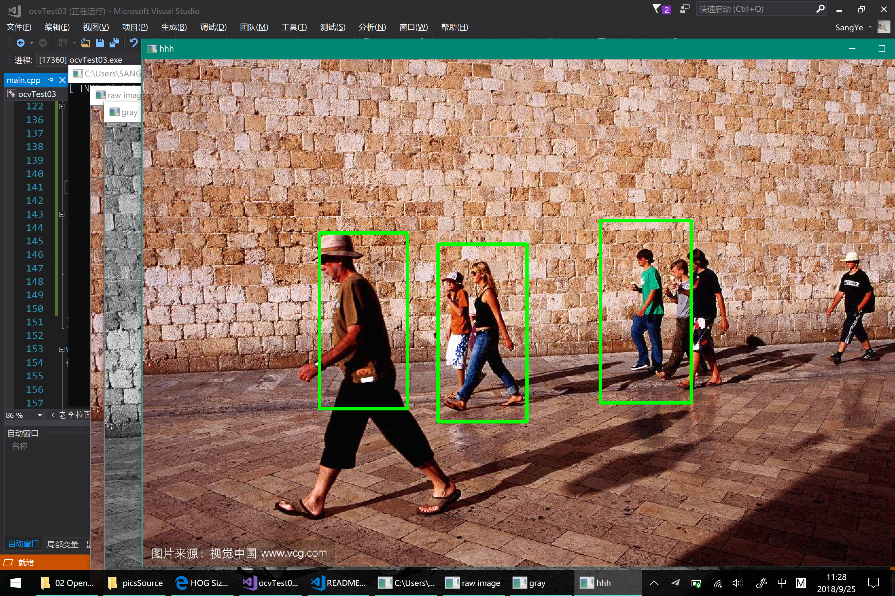


Obviously, it is not precise to detect all people in the pic.

Maybe next time I will learn how to fix this issue.

Here is code
``` C++
//SVM 检测人群 7938000个描述子 速度较慢
HOGDescriptor hog = HOGDescriptor();
hog.setSVMDetector(hog.getDefaultPeopleDetector());
vector<Rect> foLocations;
hog.detectMultiScale(src, foLocations,0, Size(8, 8), Size(32, 32), 1.05);
Mat newSrc = src.clone();
for (size_t i = 0; i < foLocations.size(); i++)
{
    rectangle(newSrc, foLocations[i], Scalar(0, 255, 0),3);
}
imshow("hhh", newSrc);
```

## Update 7 Descriptor

Yesterday, we learnt how to use HOG to recoginize the count of people. And today we are practicing to use descriptors to match a thing in another pic such as looking for a book in the gallery.

Picture blow shows what we are looking for.

> 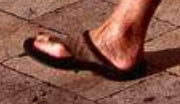

And this is the pic we download form Internet.

> 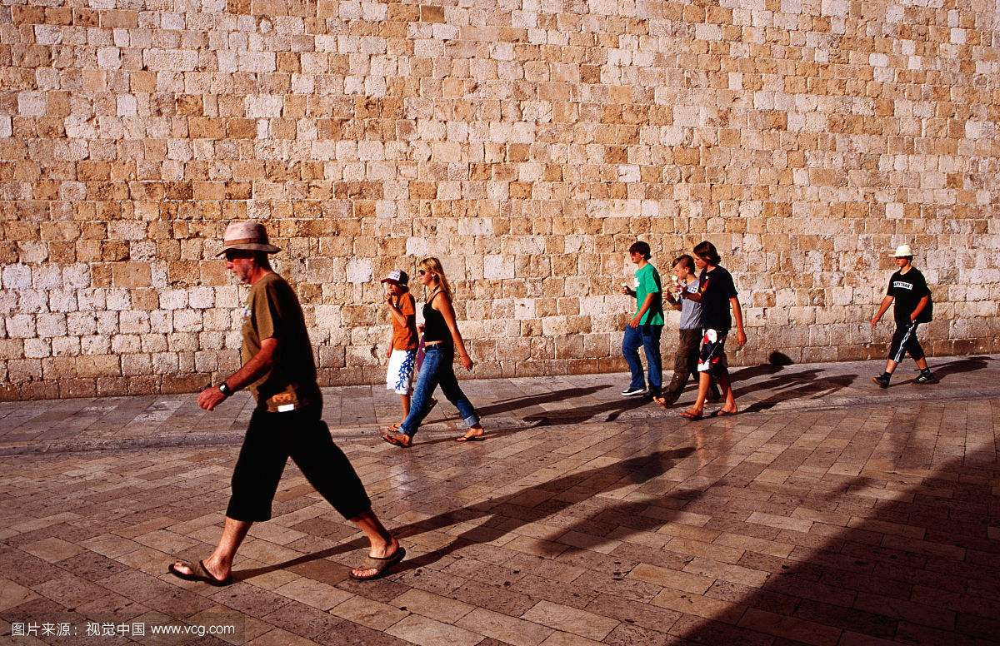

After compiling these code:

```C++
//作用：匹配两张图像

//需要两个描述子
//本次采用SURF描述子
Ptr<SURF> detector = SURF::create(400);
//储存两个描述子的keypoint
vector<KeyPoint> keyPoint_1;
vector<KeyPoint> keyPoint_2;

//声明两个描述子
Mat descriptor_1, descriptor_2;
detector->detectAndCompute(src, Mat(), keyPoint_1, descriptor_1);
detector->detectAndCompute(img_1, Mat(), keyPoint_2, descriptor_2);

//匹配
BFMatcher bfMatcher;
vector<DMatch> matches;
bfMatcher.match(descriptor_1, descriptor_2, matches);

//绘画
Mat resImg;
drawMatches(src, keyPoint_1, img_1, keyPoint_2, matches, resImg);
imshow("res", resImg);
```

We got :

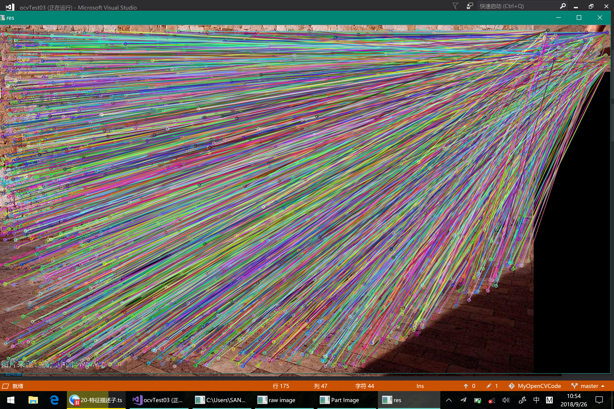

The steps of code and why I write this show in comments.

## Update 8 FLANN

Using API FlannBasedMatcher, I got the same result as BruteForce Match.

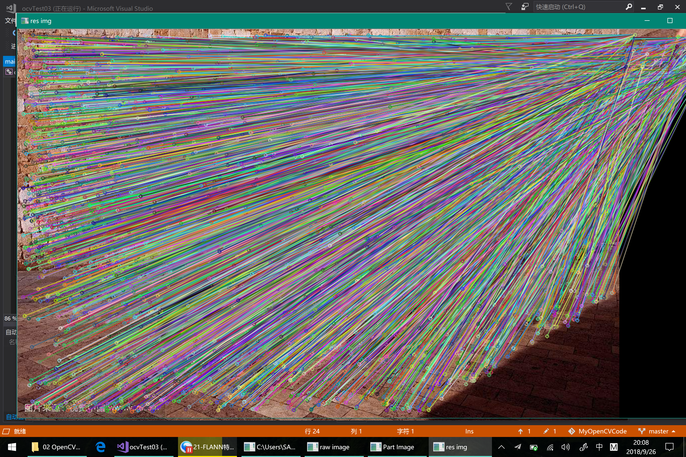

The filter is necessary to use, and the effect is obviously.You could esaily recognize them.

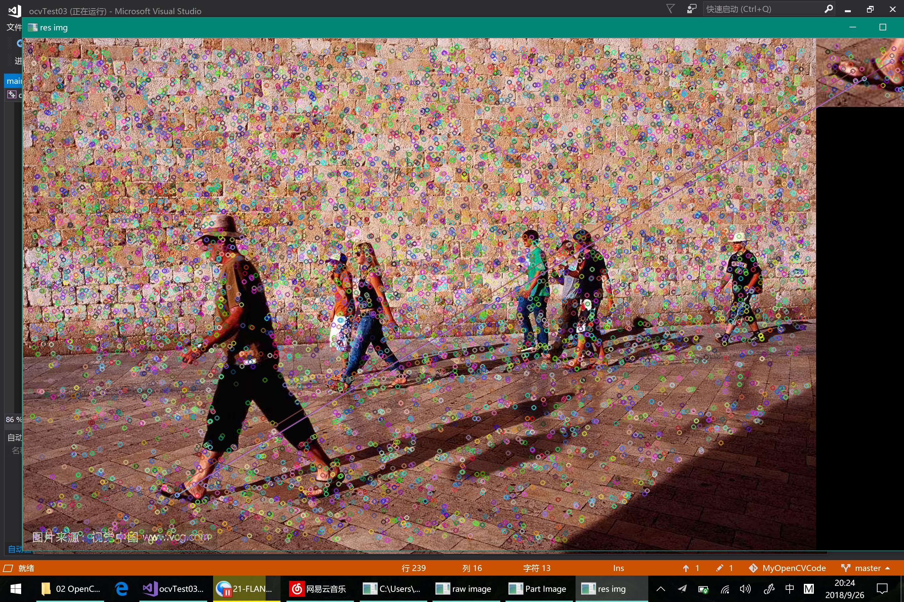

However I could not totally understand how it works.

--- 


## Update 9 KAZE
``` C++
Ptr<KAZE> detector = KAZE::create();
vector<KeyPoint> keyPoints;
detector->detect(src, keyPoints);

printf("KAZE");

Mat keyPointImage;
drawKeypoints(src, keyPoints, keyPointImage, Scalar::all(-1), DrawMatchesFlags::DEFAULT);;
imshow("kaze res", keyPointImage);
```

As the description said, the performance is better than SURF and SHIF, but I could not tell.

Here is the KAZE image:

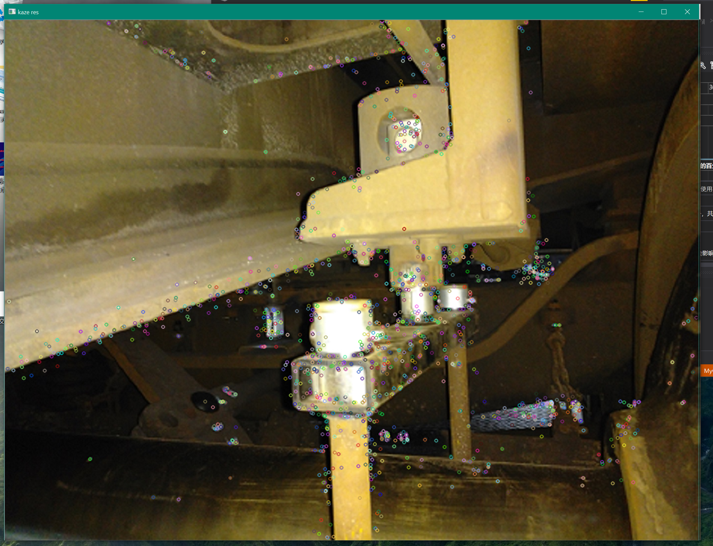

AKAZE accelerates the process time of KAZE, just replace "KAZE" by "AKAZE". Other codes keep same.

## Update 10 Face Detection

BRISK took a short time.And the "Face Detection" really annoyed me.

After fuking two months learning ,just a few lines of code could be implement. I am regreting why I learning for so long.

Fine,it is ok. And time for now I should write how to use Face Detection Code:

Here is fucking fish code：

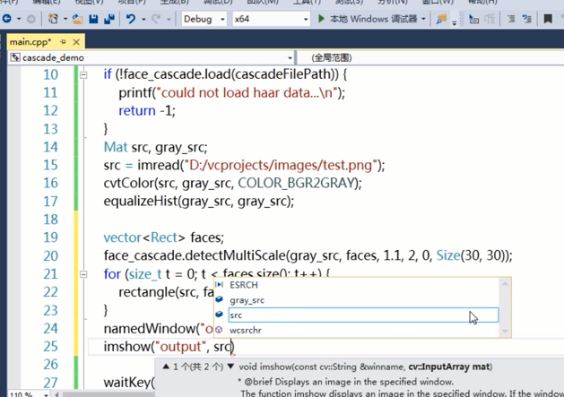

First we should find our OpenCV install folder where we could find 

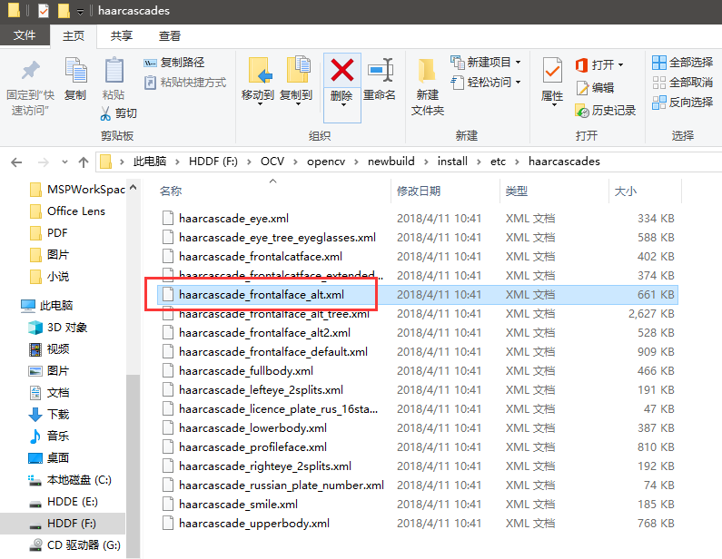

And full path that I used in code.which you could replace yours:

```C
String caPath = "F:/OCV/opencv/newbuild/install/etc/haarcascades/haarcascade_frontalface_alt.xml";
```
Ok,then you could just paste my code and press F5 run the program.

```C++

#pragma region FaceDetection 人脸检测

//在Surface上需要更改位置（用的是自带的face训练集）
String caPath = "F:/OCV/opencv/newbuild/install/etc/haarcascades/haarcascade_frontalface_alt.xml";
CascadeClassifier face_cascade;
if (!face_cascade.load(caPath))
{
    printf("face cascade could not load");
    waitKey(0);
    return -1;
}

cvtColor(src, graySrc, COLOR_BGR2GRAY);
equalizeHist(graySrc, graySrc);

vector<Rect> faces;
face_cascade.detectMultiScale(graySrc, faces,1.1,2,0,Size(30,30));
for (size_t i = 0; i < faces.size(); i++)
{
    rectangle(src, faces[i], Scalar(0, 0, 255));
}
namedWindow("face detection", WINDOW_AUTOSIZE);
imshow("face detection", src);

#pragma endregion

```

the result shows:

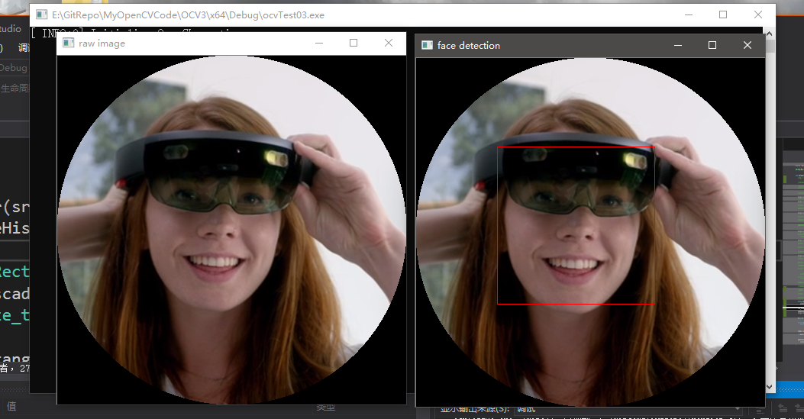

>   Oh, btw,you need to replace your face picture path,which named "src".And graySrc is temporary Mat to store gray pic.

---


recently I am thinking of how to choose between ASP.Net and OpenCV. My company needs me to learn ASP.Net to build some websites, which is aimed to optimize workflow.

My teacher told me that solving your working issue which leads your direction.OpenCV now could be added to wait list.When I get free time, I may learn it again.

These days I am too lazy to update, but from now on. I will keep code updating!!!


